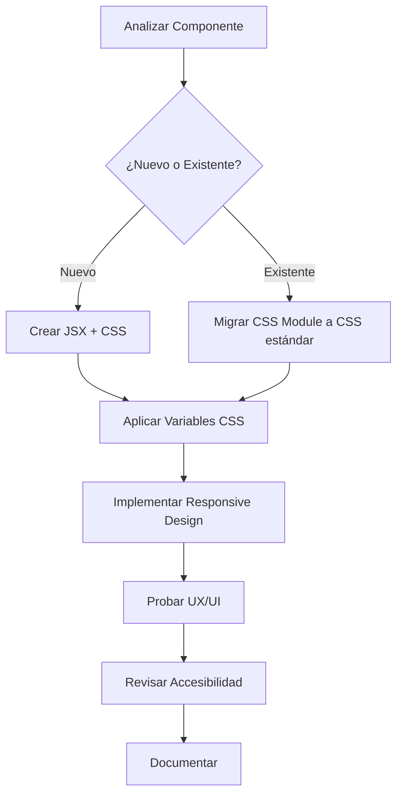

# Flujo de Trabajo para Desarrollo - Gestión de Seguros

Este documento describe el flujo de trabajo recomendado para continuar el desarrollo y mantenimiento de la aplicación Gestión de Seguros, particularmente en lo que respecta a la interfaz de usuario y el CSS.

## Visión General del Proceso



## 1. Análisis de Componentes

Antes de comenzar a trabajar en un componente, evalúa:

- **Propósito y función**: ¿Qué hace este componente?
- **Estado actual**: ¿Qué estilo tiene actualmente?
- **Necesidades de usuario**: ¿Cómo interactuarán los usuarios con él?
- **Componentes relacionados**: ¿Hay otros componentes que deban tener una apariencia similar?
- **Patrones existentes**: ¿Existen patrones de UI que podamos reutilizar?

## 2. Creación de Nuevos Componentes

### Estructura de Archivos
```
frontend/src/views/
└── categoría/
    ├── ComponenteNuevo.jsx
    └── ComponenteNuevoFun.js (opcional, para lógica de negocio)
```

```
frontend/src/views/estilos/
└── ComponenteNuevo.css
```

### Proceso

1. **Diseñar la UI**: Esboza la estructura del componente.
2. **Implementar JSX**: Crea el componente React con un enfoque semántico.
3. **Crear archivo CSS**: Usa el mismo nombre que el componente.
4. **Seguir convenciones de nomenclatura**: Usa el prefijo del componente para clases CSS.

## 3. Migración de Componentes Existentes

### Identificar Candidatos para Migración

Prioridad según:
- Frecuencia de uso
- Visibilidad en la aplicación
- Problemas de UX/UI conocidos
- Facilidad de migración

Referirse al archivo `TAREAS_FUTURAS.md` para ver la lista de componentes pendientes de migración.

### Proceso de Migración

1. **Copia de seguridad**: Duplica el archivo antes de modificarlo.
2. **Crear archivo CSS**: Crea un archivo CSS estándar basado en el module.css actual.
3. **Actualizar importaciones**: Reemplaza el import de CSS Modules por el nuevo CSS estándar.
4. **Reemplazar selectores**: Cambia `className={styles.nombreClase}` a `className="componente-nombreClase"`.
5. **Actualizar JSX**: Reorganiza el JSX para mejorar estructura y semántica si es necesario.
6. **Probar y ajustar**: Verifica que todo funcione correctamente y haz ajustes.

## 4. Uso de Variables CSS

Las variables CSS globales están definidas en `frontend/src/global.css`. Úsalas siempre para mantener la consistencia:

```css
/* Ejemplo de uso de variables */
.mi-componente {
  color: var(--color-primary);
  font-size: var(--font-size-md);
  padding: var(--spacing-md);
  border-radius: var(--border-radius-sm);
  box-shadow: var(--shadow-md);
}
```

### Variables Principales

- **Colores**: `--color-primary`, `--color-primary-dark`, etc.
- **Espaciado**: `--spacing-xs`, `--spacing-sm`, `--spacing-md`, etc.
- **Tipografía**: `--font-size-sm`, `--font-size-md`, etc.
- **Bordes**: `--border-radius-sm`, `--border-radius-md`, etc.
- **Sombras**: `--shadow-sm`, `--shadow-md`, `--shadow-lg`.

## 5. Responsive Design

Todos los componentes deben ser completamente responsivos. Utiliza:

```css
/* Mobile First Approach */
.componente {
  /* Estilos para móvil */
}

@media (min-width: 768px) {
  .componente {
    /* Estilos para tablet */
  }
}

@media (min-width: 1024px) {
  .componente {
    /* Estilos para desktop */
  }
}
```

### Puntos de quiebre estándar

- **Móvil**: < 768px
- **Tablet**: 768px - 1023px
- **Desktop**: ≥ 1024px

## 6. Pruebas de UI/UX

### Lista de verificación

- [ ] El componente se ve bien en diferentes tamaños de pantalla
- [ ] Los colores cumplen con la relación de contraste (WCAG AA)
- [ ] Las interacciones (hover, focus, active) son intuitivas
- [ ] La jerarquía visual es clara
- [ ] Los mensajes de error son descriptivos y visibles
- [ ] La navegación por teclado funciona correctamente

### Herramientas recomendadas

- **Chrome DevTools**: Para pruebas responsivas
- **Lighthouse**: Para evaluación de accesibilidad
- **WAVE**: Para verificar accesibilidad

## 7. Documentación

### Comentarios en el código

```css
/* 
 * Componente: Nombre
 * Descripción: Breve descripción de la función del componente
 * Autor: Nombre del desarrollador
 * Fecha: Fecha de creación/modificación
 */

/* Sección principal del componente */
.componente-container {
  /* Propiedades principales */
}

/* Versión para móvil */
@media (max-width: 768px) {
  /* Modificaciones para móvil */
}
```

### Actualización de documentos

Después de realizar cambios significativos:

1. Actualiza `REGISTRO_CAMBIOS.md` con los cambios realizados
2. Actualiza `TAREAS_FUTURAS.md` para reflejar el progreso
3. Si es necesario, agrega ejemplos a `EJEMPLOS_CSS.md`

## 8. Mejores Prácticas

### Estructura de CSS

1. **Organización**: Inicia con estilos generales, luego específicos
   ```css
   /* 1. Variables y configuraciones */
   /* 2. Layouts y contenedores */
   /* 3. Componentes específicos */
   /* 4. Estados (hover, active, etc.) */
   /* 5. Media queries */
   ```

2. **Evita selectores excesivamente específicos**
   ```css
   /* Evitar esto */
   .componente-container .componente-titulo .componente-texto { ... }
   
   /* Preferir esto */
   .componente-texto { ... }
   ```

3. **Evita `!important`**: Solo úsalo como último recurso

4. **Evita estilos en línea**: Prefiere siempre clases CSS

### Accesibilidad

1. **Contraste adecuado**: Texto legible sobre fondos
2. **Enfoque visible**: Mantén o mejora los estilos de `:focus`
3. **Textos alternativos**: Para imágenes y elementos visuales
4. **Etiquetas en formularios**: Siempre usa `<label>` con `for`
5. **ARIA**: Cuando sea necesario para mejorar accesibilidad

## Conclusión

Seguir este flujo de trabajo garantizará una transición exitosa del sistema actual de CSS Modules al nuevo sistema CSS estandarizado. Los beneficios incluyen:

- Mayor consistencia visual
- Código CSS más mantenible
- Mejor experiencia de usuario
- Proceso de desarrollo más eficiente

Ante cualquier duda, consultar los documentos:
- `README.md`: Visión general del proyecto
- `GUIA_ESTILOS_CSS.md`: Guía detallada de estilos
- `EJEMPLOS_CSS.md`: Ejemplos prácticos de implementación
- `TAREAS_FUTURAS.md`: Componentes pendientes de migración

---

Documento creado: 17 de junio de 2025  
Última actualización: 17 de junio de 2025
